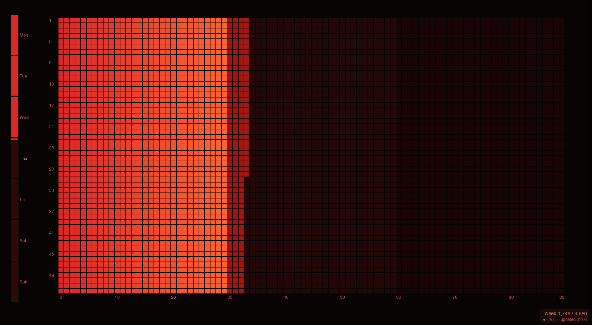

# Life Calendar Wallpaper

A live desktop wallpaper that renders a **life calendar** — a grid where each cell represents one week of your life. Elapsed weeks are shaded; future weeks are dim. Thirty-year periods use distinct colours so major life phases are immediately visible. If you liked this, [buy me a coffee!](https://ko-fi.com/knguyenanhoa)



## Requirements

- Python 3.9+
- macOS 12+ (primary) or Linux (X11/Wayland)
- `Pillow` (installed automatically by `install.sh`)
- `rumps` (optional, for a native macOS menu-bar icon)

## Quick Start

```bash
# 1. Clone / download the repo, then:
bash install.sh
```

`install.sh` will:
1. Create a `.venv` virtual environment and install `Pillow` (and `rumps` on macOS).
2. Write a `~/Library/LaunchAgents/com.lifecal.wallpaper.plist` so the app auto-starts on login.
3. Launch the app immediately.

On first run the Settings window opens automatically (no birthday is set yet).

## Manual Usage

```bash
# Activate the venv
source .venv/bin/activate

# Start normally (opens Settings if no birthday is configured)
python main.py

# Open Settings window on startup
python main.py --settings

# Render once and exit (good for testing)
python main.py --render-once

# Set birthday and theme from the command line
python main.py --birthday 1990-05-15 --theme dark
```

## Settings Window

Open it any time by:
- Clicking **Open Settings** in the menu-bar icon (if `rumps` is installed), or
- Double-clicking the Dock icon (hidden window), or
- Running `python main.py --settings`

| Field | Description |
|---|---|
| Birthday | Your date of birth (`YYYY-MM-DD`). Drives the elapsed-week calculation. |
| Theme | Visual theme (`dark`, `light`, `monochrome`). |
| Update interval | How often the wallpaper is re-rendered (minutes). Default: 60. |
| Show year labels | Toggle the year axis labels. |
| Show week labels | Toggle the week axis labels. |

Changes are applied immediately when you click **Apply**.

## Themes

Three built-in themes. Each has distinct colours per 30-year period for both elapsed and future cells.

| Theme | Background | Period colours |
|---|---|---|
| `dark` | Near-black | Red / Blue / Green (muted) |
| `light` | Off-white | Red / Blue / Green (pastel) |
| `monochrome` | Near-black | Light grey / mid grey / dark grey |

To add a custom theme, edit `config.py` — add an entry to the `THEMES` dict following the `Theme` dataclass pattern.

## Configuration File

Stored at `~/.lifecal/config.json`. You can edit it directly; the app picks up changes within ~2 seconds.

```json
{
  "birthday": "1990-05-15",
  "theme": "dark",
  "update_interval_seconds": 3600,
  "canvas_width": 0,
  "canvas_height": 0,
  "padding_top": 80,
  "padding_bottom": 80,
  "padding_left": 80,
  "padding_right": 80,
  "cell_gap": 2,
  "show_year_labels": true,
  "show_week_labels": true
}
```

Set `canvas_width` / `canvas_height` to `0` to auto-detect the display resolution.

## Grid Layout

Defined by constants at the top of `config.py`:

```python
YEARS          = 90   # columns (one per year)
WEEKS_PER_YEAR = 52   # rows (one per week)
PERIOD_YEARS   = 30   # colour-band width in years
```

Change these to reshape the grid without touching anything else.

## Logs (macOS)

```
~/.lifecal/logs/stdout.log
~/.lifecal/logs/stderr.log
```

## Uninstall

```bash
bash uninstall.sh
# optionally:
rm -rf ~/.lifecal
```

## Project Structure

```
x-lifecal-wallpaper/
├── main.py          # entry point, update loop, tray icon
├── config.py        # settings, themes, constants
├── renderer.py      # Pillow-based grid renderer
├── wallpaper.py     # OS wallpaper setter (macOS + Linux)
├── settings_ui.py   # tkinter settings window
├── install.sh       # one-step install + LaunchAgent setup
├── uninstall.sh     # remove LaunchAgent
└── requirements.txt # Pillow
```
